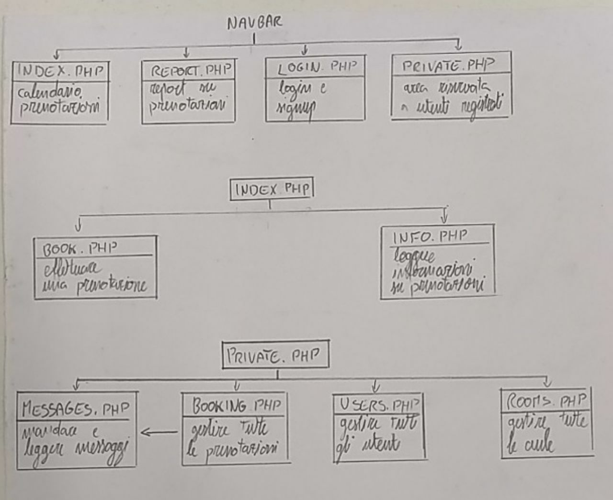

# 5AII_Info_PHPDB_PrenotazioneAule

PROGETTO INFORMATICA: PHP + SQL   

Si vuole realizzare un sito web per la gestione online della prenotazione delle aule dell’istituto.  
Ogni utente può registrarsi al sito, ed avere un account solo dopo l’approvazione dell’admin .   

L’utente tramite il proprio account può: 
-Visionare le aule dell’istituto 
-richiedere una prenotazione ( solo dopo aver effettuato il login ) 
-Visionare le proprie prenotazioni  
-inviare richieste di info  

Il responsabile delle prenotazioni deve poter: 
-visionare ed operare su tutti gli account registrati 
-inserire/eliminare/aggiungere aule 
-visualizzare tutte le prenotazioni 
-visualizzare info su una prenotazione / su tutte le prenotazioni di un utente 
-contattare un utente per info su una prenotazione  

Descrivere e realizzare un db, creare tramite il linguaggio PHP l’interfaccia web.  
Il progetto deve presentare: 
Database: diagramma E/R, schema logico, sql per creare il db. 
CSS, JavaScript, Html. 
PHP: connessione al DB, Session/Cookie, interfaccia web.    

** https://photos.google.com/photo/AF1QipNYNGlyZD9ASlnogDs7kG3dwsExMbqZMAvI_mmQ?hl=it  
** https://www3.itisrossi.vi.it/web/index.php  
** HTTPS

  
Heroku: gigorawih@1rentcar.top  
Password : no dog

 
<a href="https://prenotazioneaule.herokuapp.com/index.php"> Demo </a>

 
